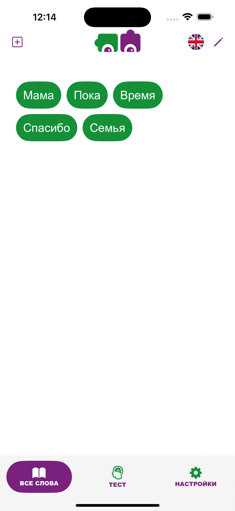
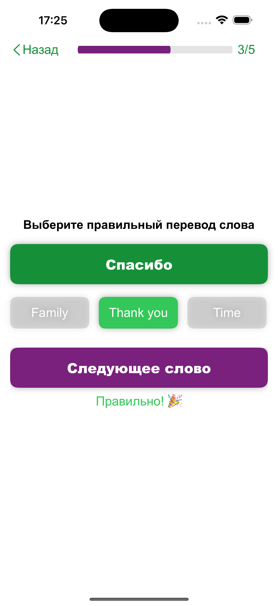
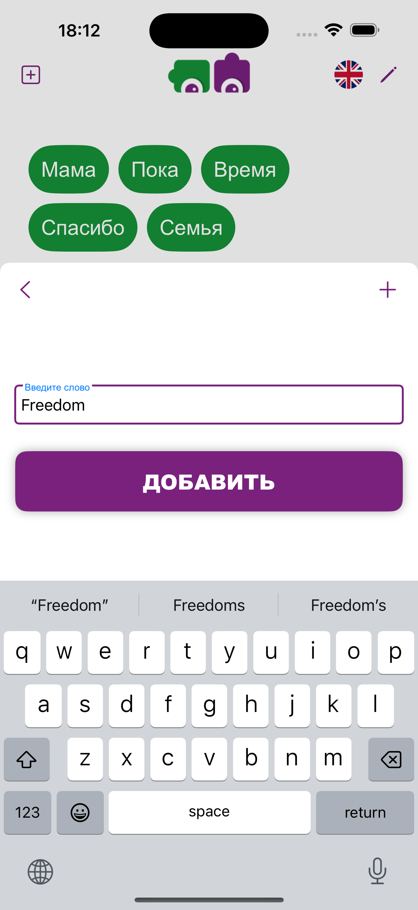

# 📚 Wordy Helper — запоминай иностранные слова, как стикеры на холодильнике

**Wordy Helper** помогает удерживать в памяти нужные иностранные слова — будь то случайно услышанное слово или то, которое никак не запоминается.  
Добавляй, повторяй, проверяй себя — просто и удобно, каждый день.

---

## 🚀 Возможности

- ✏️ Добавляй собственные слова с переводом
- 🌍 Поддержка трёх языков: английский, французский и итальянский
- 🧠 Три вида тестов:
  - 🎧 Аудио — прослушай слово и выбери правильный перевод
  - ✅ Выбор — найди верный вариант из трёх
  - ⌨️ Ввод — напиши правильный перевод сам

---

## 🖼 Скриншоты

  

---

## ⚙️ Установка (для разработчиков)

1. Клонируй репозиторий:
   ```bash
   git clone https://github.com/ivankovdaniil/wordy.git
   ```
2. Открой `WordyHelper.xcodeproj` (или `.xcworkspace`, если используется Swift Package Manager)
3. Запусти проект в Xcode 15+

---

## 🛠 Используемые технологии

- Swift 6
- SwiftUI
- SwiftData

---

## 📄 Лицензия

MIT License — свободно используйте и улучшайте.

---

## 📬 Обратная связь

Если нашли ошибку или хотите предложить улучшения — пишите на [Ivankovdaniil@gmail.com](mailto:Ivankovdaniil@gmail.com)
